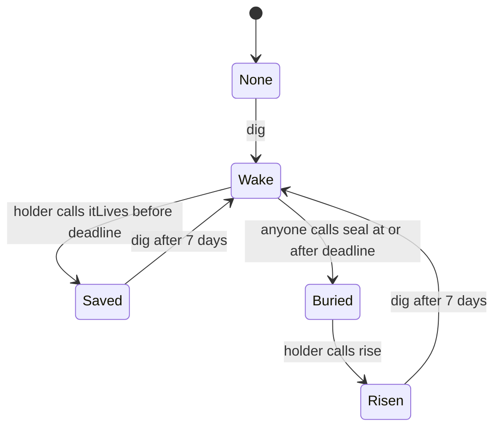

# Memecoin Cemetery

A tokenless, ownerless cemetery for ERC-20s on **Robinhood Chain, chain ID 4663**.
Anyone can propose a burial, any qualifying holder can object, and anyone can
pay respects. Each grave has one of 24 fixed epitaphs and an SVG headstone
rendered entirely on-chain. Buried tokens can return as zombies.

There is no launch token, NFT, fee, owner, administrator, pause, proxy, upgrade,
external runtime dependency, or constructor argument. No token approvals or
transfers are involved. Every callable entry point rejects ETH, and the
constructor is nonpayable. As with any EVM address, unsolicited forced ETH is
possible; there is no withdrawal or rescue mechanism.

**Deployment status:** this repository is a locally tested deployment handoff.
No deployment address or explorer verification is claimed. The network deployer
must deploy and verify the source before announcing an address. No wallet keys,
RPC credentials, or transactions are needed to build or test this project.

## Lifecycle



| Call | Conditions and result |
| --- | --- |
| `dig(token, epitaphId)` | Token has code, a readable positive supply, and epitaph index 0–23. Starts a 72-hour wake from None, Saved or Risen; Saved/Risen must finish their cooldown first. |
| `itLives(token)` | Caller is a holder and `block.timestamp < wakeEndsAt`. Saves the token immediately, increments saves and starts a seven-day cooldown. |
| `seal(token)` | Wake is still active and `block.timestamp >= wakeEndsAt`. Anyone creates the next numbered burial, increments the current grave count and appends to recent burials. |
| `mourn(token)` | Token is Buried. Each address may mourn once for this burial number. Counts addresses, not unique people. |
| `rise(token)` | Token is Buried and caller is a holder. Keeps the burial record, increments rises, decreases the current grave count and starts a seven-day cooldown. |

Cooldowns expire inclusively: a new wake is allowed exactly seven days after
the save/rise transaction. Saves and rises have no time lock beyond the stated
state and wake conditions. All timing uses `block.timestamp`, never block
numbers. The deadline alone does not change state: someone must call `seal`.
After the wake deadline, holders must wait for sealing and then use `rise`.
This is an unopposed nomination process; it does not inspect trading activity,
prices, liquidity, holder engagement, or prove that a token is economically dead.

`graveOf(token)` returns the latest attempt as a tuple named `Grave` with
`state, digger, epitaphId, dugAt, wakeEndsAt, sealedAt, burials, rises, saves,
mourners`. State numbers are None=0, Wake=1, Buried=2, Saved=3, Risen=4.
Never-dug tokens return zeroed fields. Opening another wake resets the latest
attempt's metadata, seal date and mourner count, but **never** its lifetime
burials, rises or saves.

`burialOf(token, number)` exposes permanent, one-based burial history. Each
record retains `digger, epitaphId, dugAt, sealedAt, mourners`. Its identity and
dates never change after sealing; mourners can increase while that specific
burial is active, and freeze when it rises. Number zero and nonexistent numbers
revert. Mourning is allowed again after a new burial.

`graveCount()` counts only currently Buried tokens. `recentBurials(n)` returns
the last `min(n, 20, total seals)` token addresses, newest first. It is a seal
history: risen tokens remain listed and repeat burials create repeated addresses.
`cooldownEndsAt(token)` returns the latest cooldown deadline (zero before any
save or rise). Events record each state change and each successful mourning.

## Who can defend a token?

```text
required balance = max(1, min(10**decimals, floor(totalSupply / 1000)))
```

This is one whole token or 0.1% of supply, whichever is smaller, with a one-base-unit
floor. A large 18-decimal token can be defended with `1e18` base units; a token
with a supply of 500 tokens needs only half a token. A 6-decimal token uses `1e6`
as its whole-token amount. Supply below 1000 base units still requires at least
one base unit; a zero balance never qualifies.

The contract reads current supply, decimals and caller balance at the objection
or rise transaction. Missing, malformed, reverting, out-of-gas, or greater-than-36
decimals default to 18. Supply and balance must each return exactly one ABI word;
otherwise the holder operation reverts. A zero supply after digging still uses
the one-unit floor. Supply must be positive whenever a new wake is opened.

Borrowed or flash-loaned balances count, and repayment does not undo the action.
This deliberately makes defending a token cheap: holders can save or raise it,
while burial always requires the full unopposed wake. There are no historical
balance snapshots, staking, lockups or delegation. Balances held inside an
exchange, pool or vault are not attributed to its users by this contract.

Every token read uses `STATICCALL` with at most 50,000 gas. Integer reads copy at
most 32 return bytes. Token implementations can lie, change their responses, or
be upgraded independently; the cemetery cannot establish truthful ownership
beyond `balanceOf`. Tokens whose supply/balance reads fail or require more gas
may be unable to be nominated or defended. Sealing and mourning require no token
calls, so broken metadata does not block those actions. Static calls prevent
token callbacks from changing cemetery state.

## Epitaphs and headstones

The 24 supplied epitaphs are stored at deployment with no setter, indexed 0–23.
`epitaph(id)` returns the exact text. Fixed choices avoid arbitrary, abusive text
being published permanently through the epitaph interface.

`headstone(token)` returns a standalone SVG string for every token ever dug,
including wakes and saved attempts. Never-dug tokens revert. The SVG includes
the token symbol, epitaph, UTC dig/seal dates, mourner count and, only when Risen,
a `RISEN` banner with the cumulative rise count. Unset seal dates display `-`.
Dates use Gregorian calendar arithmetic; the Unix epoch is `1970-01-01`.

Symbols are untrusted live token metadata. Only canonical ABI strings of 1–64
printable ASCII bytes are displayed. Missing, malformed, empty, oversized,
non-printable, non-ASCII and failed symbols fall back to `0x1234...abcd` from
the token address. Return-data copying is bounded to 128 bytes. The XML encoder
escapes `& < > " '` and defensively replaces any non-printable byte passed to
it with `?`. Legacy `bytes32` symbols use the address fallback. A token can
change its displayed symbol independently; XML escaping prevents markup
injection, but printable symbols can still be misleading. Integrations should
identify tokens by their full addresses.

The date calculation follows the March-based 400-year-era arithmetic described
in [Howard Hinnant's calendar algorithms](https://howardhinnant.github.io/date_algorithms.html#civil_from_days).

## Build and check

Install Foundry and provide native **Solidity 0.8.26** in Foundry's compiler
cache before disconnecting from the network. No compiler binary is vendored.
The test/script library is vendored as ordinary files in `lib/forge-std` at
v1.9.7, commit `77041d2ce690e692d6e03cc812b57d1ddaa4d505`; its licenses and
provenance are included. Do not run a dependency installer or initialize a
submodule. The application itself imports no library.

```sh
forge build
forge test
forge build --offline
forge test --offline
forge fmt --check
```

`foundry.toml` pins solc 0.8.26, Cancun, optimizer 200, `bytecode_hash = "none"`,
with FFI disabled and no filesystem permissions. Keep those settings unchanged
for deployment and verification. Tests have no environment-variable reads,
RPC calls, forks, private keys, FFI, filesystem writes or shared external state.
They run independently and in parallel.

The tests cover all states and custom errors, timing boundaries, exact epitaphs,
18/6-decimal and tiny-supply thresholds, hostile token responses, XML escaping,
calendar boundaries, mourning and history, recent ordering/capping, ETH
rejection, chain-gated deployment, runtime size and forbidden opcodes. Fuzzing
runs 256 cases per property. Stateful invariants run 128 sequences at depth 64
across five tokens, starting in all five states, and check grave counts,
lifetime counters and permanent burial identities. These local checks are not
an independent security audit.

The generated ABI is `docs/abi/MemecoinCemetery.json`. Regenerate it after a
source change with:

```sh
forge inspect src/MemecoinCemetery.sol:MemecoinCemetery abi --json > docs/abi/MemecoinCemetery.json
```

## Deployment and explorer verification

Parameters: one application named `MemecoinCemetery`, chain ID **4663**, empty
constructor arguments (`[]`, ABI encoding `0x`), zero deployment ETH and no
post-deployment initialization. Factory deployment and direct deployment give
the same application behavior: the constructor assigns no authority to its
caller. The deployment service owns any launch manifest and confirmed address
handoff. The contract needs no protocol or token addresses configured.

The following commands are for the authorized network deployer. Supply an
approved Robinhood Chain RPC, the deployer's keystore account and sender, and
the confirmed deployment address through local shell variables. No `.env`
file is required. Do not override the RPC chain ID: the script checks the
actual execution chain and rejects every chain other than 4663.

```sh
# Read-only RPC check; this must report 4663.
cast chain-id --rpc-url "$CEMETERY_RPC_URL"

# Simulate first. No broadcast occurs without --broadcast.
forge script script/Deploy.s.sol:Deploy \
  --rpc-url "$CEMETERY_RPC_URL" --sender "$CEMETERY_DEPLOYER"

# Direct deployment option for an authorized operator (not run by this assignment).
forge script script/Deploy.s.sol:Deploy \
  --rpc-url "$CEMETERY_RPC_URL" --sender "$CEMETERY_DEPLOYER" \
  --account "$CEMETERY_KEYSTORE_ACCOUNT" --broadcast

# Verify the actual deployed address with the chain explorer's Etherscan-compatible API.
forge verify-contract "$CEMETERY_ADDRESS" src/MemecoinCemetery.sol:MemecoinCemetery \
  --chain 4663 --compiler-version v0.8.26+commit.8a97fa7a \
  --num-of-optimizations 200 --verifier etherscan \
  --verifier-url "$CEMETERY_VERIFIER_URL" \
  --etherscan-api-key "$CEMETERY_EXPLORER_API_KEY" --watch

# Alternatively, prepare standard JSON for the explorer's manual verification form.
forge verify-contract "$CEMETERY_ADDRESS" src/MemecoinCemetery.sol:MemecoinCemetery \
  --chain 4663 --show-standard-json-input > /tmp/MemecoinCemetery.standard-input.json

# Compare the complete runtime code; this contract has no immutables or linked libraries.
forge inspect src/MemecoinCemetery.sol:MemecoinCemetery deployedBytecode > /tmp/cemetery.expected.hex
cast code "$CEMETERY_ADDRESS" --rpc-url "$CEMETERY_RPC_URL" > /tmp/cemetery.deployed.hex
diff /tmp/cemetery.expected.hex /tmp/cemetery.deployed.hex
```

Obtain the RPC and explorer API endpoint from the network's approved deployment
configuration; neither is assumed or fetched by this project. For an explorer
using a different verification provider, use that provider's corresponding
Foundry flag or upload the standard JSON. Select compiler 0.8.26, Cancun,
optimizer 200 and MIT license; leave constructor arguments empty. Verification
must preserve `metadata.bytecodeHash = "none"`; flattened-source verification
with different settings is insufficient. `docs/deployment/build.json` records
local bytecode sizes and hashes for the pinned build, and
`docs/deployment/MemecoinCemetery.standard-input.json` contains its compiler input.

The deployer must record the transaction, confirmed address, chain ID and a
successful explorer verification link, and compare deployed runtime bytes
before publishing. If the launch factory deploys the application, verify the
factory-created application address instead of running a second direct
deployment. This assignment performs no signing or broadcasting.

There are no ongoing administrator tasks or treasury responsibilities. Holders
must monitor `WakeOpened` and submit objections before the deadline. Any caller
can seal expired wakes; any holder can raise a buried token. Integrators should
index the events and use numbered burial records for historical displays.
Chain availability, transaction inclusion and timestamp rules are external
assumptions; an ownerless contract cannot guarantee a holder's transaction is
included before a deadline.
